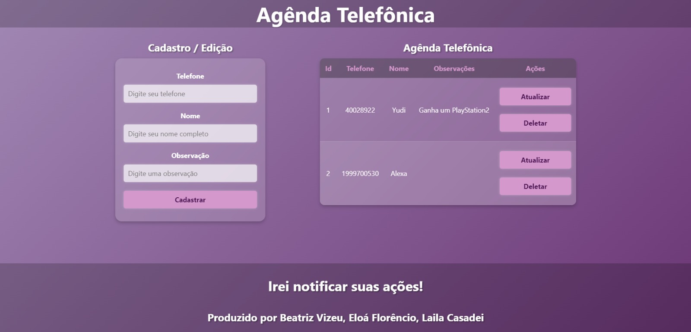

# Projeto Agênda Telefônica 
Exemplo de CRUD simples **full-stack** com uma tabela de clientes.


## Tecnologias
- **Frontend**: HTML, CSS e JavaScript
- **Backend**: NodeJS com Express
- **Banco de Dados**: MySQL
- **Testes**: Insomnia

## Como rodar
1. Clonar o repositório
2. Abrir o projeto no VsCode
3. Abrir o terminal **cmd** ou **bash**, navegar até a pasta **./api** e rodar:
```
bash
cd api
npm install
npm start
# ou
npx nodemon
```
4. Instalar o Banco de dados no Mysql (Via XAMPP dar start em MySQL).
5. Navegar até a pasta **./web** e executar o arquivo **index.html** no navegador ou via live server do VsCode.

> [!NOTE]
> Para rodar, é necessário que sua máquina tenha Git, Node.js, MySQL e VSCode.